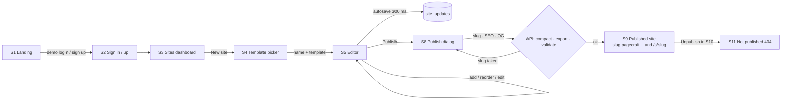
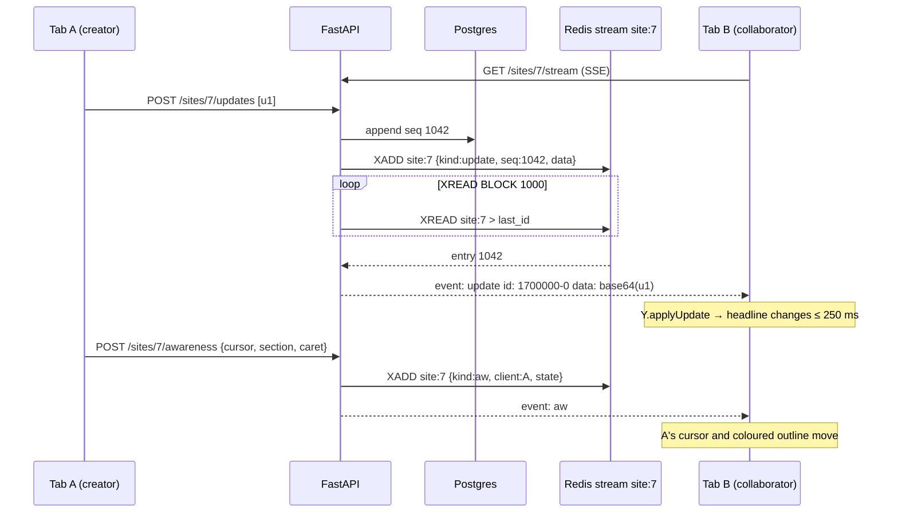
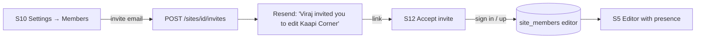
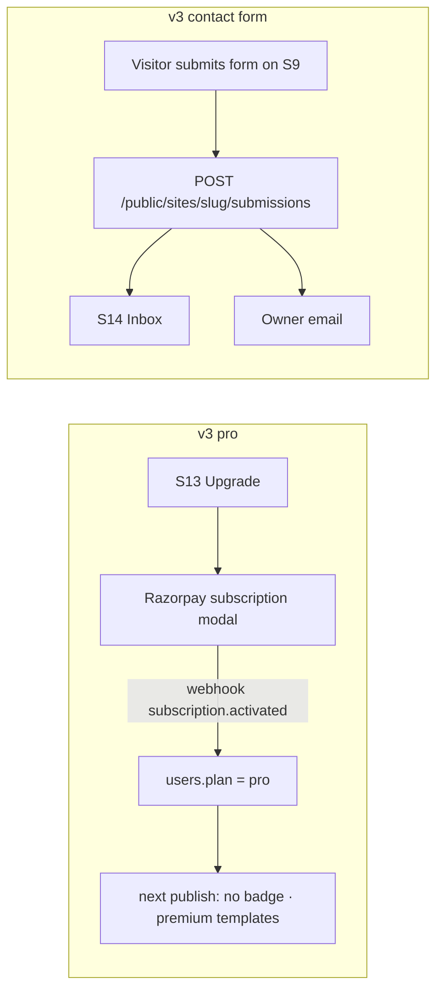

# Pagecraft — User Flows & Screen Index

**Lifecycle step:** 3 of 17 · **Locked:** 2026-09-16 · Pairs with [03-requirements.md](03-requirements.md); every screen below gets a mockup in [04-ui-mockups.md](04-ui-mockups.md).

## Flow 1 — From template to live site (v1, the main path)



## Flow 2 — Document lifecycle (v1 persistence, v2 sync)

```mermaid
stateDiagram-v2
  [*] --> Draft: clone template snapshot
  Draft --> Draft: updates appended (seq++)
  Draft --> Compacted: every 50 updates · pycrdt merge → snapshot
  Compacted --> Draft: more updates
  Draft --> Published: Publish → export JSON → publications v(n)
  Published --> Draft: any edit (site stays live on v(n))
  Published --> Unpublished: Unpublish
  Unpublished --> Published: Publish again → v(n+1)
  note right of Draft
    v1: client POSTs update batches; reload replays snapshot + tail
    v2: same POST also XADDs to site:{id}; SSE fans out to other tabs
  end note
```



## Flow 3 — Publish (v1)

```mermaid
flowchart TD
  P[POST /sites/id/publish] --> C[Load snapshot + tail · pycrdt apply]
  C --> S[Write compacted snapshot]
  S --> J[Export doc → JSON]
  J --> V{zod-equivalent pydantic validation}
  V -->|fail| E[422 with the offending section]
  V -->|ok| W[publications v(n) · sites.published_slug]
  W --> R[POST web /api/revalidate?tag=site:slug]
  R --> OK[200 with URL]
```

## Flow 4 — Live co-editing (v2)



## Flow 5 — Invite a collaborator (v2)



## Flow 6 — Pro subscription & contact form (v3)



## Flow 7 — Custom domain (v4)

```mermaid
flowchart LR
  S[S10 Settings → Domain] -->|kaapicorner.in| R[Show DNS record to add]
  R -->|poll every 15 s| C{record resolves?}
  C -->|no| R
  C -->|yes| V[Vercel Domains API: add domain]
  V --> SSL{certificate issued?}
  SSL -->|pending| V
  SSL -->|yes| Live[Domain live · canonical set]
  Vis[Visitor: kaapicorner.in] --> MW[middleware: host → /public/hosts → slug]
  MW --> Page[/s/kaapi-corner rendered]
```

## Flow 8 — Export and import (v4)

```mermaid
flowchart LR
  P[Publish v(n)] -->|toggle on| G[Push to GitHub: tree + commit]
  E[S10 Export → Download] --> W[web /api/export renders SiteRenderer to HTML]
  W --> Z[API zips html · css · images · pagecraft.json]
  Z --> D[Download]
  D -->|later| I[S3 Dashboard → Import zip]
  I --> Val{validate SiteContent}
  Val -->|ok| Doc[pycrdt builds Y.Doc · images → Blob]
  Doc --> New[New draft site]
  Val -->|bad| Err[422 naming the section]
```

## Screen index

| # | Screen | Route | Who | Version | Notes |
|---|---|---|---|---|---|
| S1 | Landing | `/` | visitor | v1 | Exists; gains demo logins + "Try it live" (v2) |
| S2 | Sign in / Sign up | `/sign-in`, `/sign-up` | all | v1 | Demo buttons |
| S3 | Sites dashboard | `/sites` | creator | v1 | Cards with live mini hero, status, URL |
| S4 | Template picker | `/sites/new` | creator | v1 | 6 templates, live preview, name + slug |
| S5 | Editor | `/sites/[id]/edit` | creator / collaborator | v1 · live in v2 | The signature screen: layers · canvas · inspector; width toggle |
| S6 | Section library | `/sites/[id]/edit` panel | creator | v1 | 10 types × variants with thumbnails |
| S7 | Inspector + theme panel | `/sites/[id]/edit` panel | creator | v1 | Schema-driven fields; palettes, font pairs, radius |
| S8 | Publish dialog | `/sites/[id]/edit` modal | creator | v1 · diff in v2 | Slug, SEO, OG; changed-sections list |
| S9 | Published site | `/s/[slug]` · `{slug}.pagecraft…` | visitor | v1 | Two templates shown, desktop + 390 px; badge |
| S10 | Site settings | `/sites/[id]/settings` | creator | v1 · members in v2 | Rename, slug, unpublish, delete |
| S11 | Not published / 404 | `/s/[slug]` state | visitor | v1 | |
| S12 | Accept invite | `/invite/[token]` | collaborator | v2 | |
| S13 | Upgrade to Pro | `/upgrade` | creator | v3 | Razorpay subscription |
| S14 | Inbox | `/sites/[id]/inbox` | creator | v3 | Contact-form submissions |
| S15 | History panel | `/sites/[id]/edit` panel | creator | v2 | Snapshots, preview, restore |
| S16 | Settings · Domain | `/sites/[id]/settings` tab | owner | v4 | DNS record, checking, live, remove |
| S17 | Settings · Export | `/sites/[id]/settings` tab | owner | v4 | Download zip, GitHub connect + push toggle |
| S18 | Import | `/sites` dialog | creator | v4 | Drop zip / json, slug check, create |
